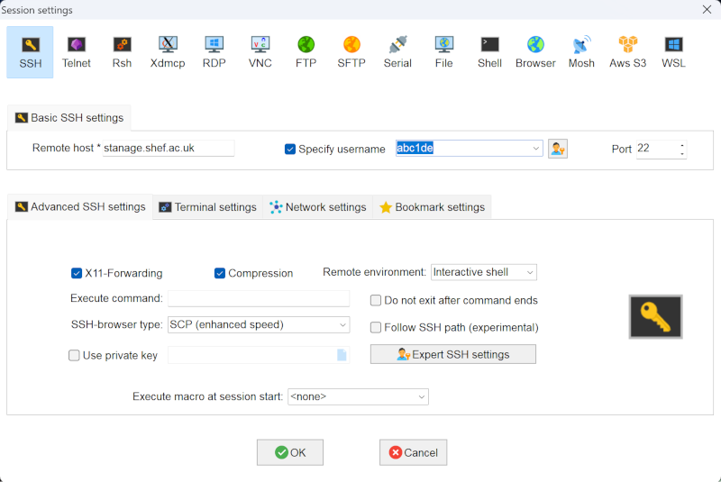

# Lab 1 - Introduction to (Py)Spark and (Sheffield)HPC

[COM6012 Scalable Machine Learning **2024**](https://github.com/COM6012/ScalableML) by [Shuo Zhou](https://shuo-zhou.github.io/) at The University of Sheffield

## Study schedule

- [Task 1](#1-connect-to-hpc-and-install-spark): To finish in the lab session on 9th Feb. **Critical**
- [Task 2](#2-run-pyspark): To finish in the lab session on 9th Feb. **Critical**
- [Task 3](#3-log-mining-with-spark---example): To finish in the lab session on 9th Feb. **Essential**
- [Task 4](#4-big-data-log-mining-with-spark): To finish in the lab session on 9th Feb. **Essential**
- [Task 5](#5-exercises-reference-solutions-will-be-provided-on-the-following-thursday): To finish by the following Wednesday 14th Feb. ***Exercise***
- [Task 6](#6-additional-ideas-to-explore-optional-no-solutions-will-be-provided): To explore further. *Optional*

**Suggested reading**:

- [Spark Overview](https://spark.apache.org/docs/3.5.0/index.html)
- [Spark Quick Start](https://spark.apache.org/docs/3.5.0/quick-start.html) (Choose **Python** rather than the default *Scala*)
- Chapters 2 to 4 of [PySpark tutorial](https://runawayhorse001.github.io/LearningApacheSpark/pyspark.pdf) (several sections in Chapter 3 can be safely skipped)
- Reference: [PySpark documentation](https://spark.apache.org/docs/3.5.0/api/python/index.html#)
- Reference: [PySpark source code](https://github.com/apache/spark/tree/master/python)

**Note - Please READ before proceeding**:

- HPC nodes are **shared** resources (**like buses/trains**) relying on considerate usage of every user. When requesting resources, if you ask for too much (e.g. 50 cores), it will take a long time to get allocated, particularly during "*rush hours*" (e.g. close to deadlines) and once allocated, it will leave much less for the others. If everybody is asking for too much, the system won't work and everyone suffers.
- Please follow **ALL steps (step by step without skipping)** unless you are very confident in handling problems by yourself.
- Please try your best to follow the **study schedule** above to finish the tasks on time. If you start early/on time, you will find your problems early so that you can make good use of the labs and online sessions to get help from the instructors and teaching assistants to fix your problems early, rather than getting panic close to an assessment deadline. Based on our experience from the past five years, rushing towards an assessment deadline in this module is likely to make you fall, sometimes painfully.

## 1. Connect to HPC and Install Spark

### 1.1 HPC Driving License and Connect to Stanage HPC via SSH

Follow the [official instructions](https://docs.hpc.shef.ac.uk/en/latest/hpc/index.html) from our university. Your HPC account has created already due to the need of this module. You have been asked to complete and pass the [HPC Driving License test](https://infosecurity.shef.ac.uk/) by Thursday 8th Feb. If you have not done so, please do it as soon as possible.

To access Stanage for the first time, you **must** connect the [university's VPN](https://www.sheffield.ac.uk/it-services/vpn). Use your university **username** such as `abc18de` and the associated password to log in.

[Mac OS/X and Linux](https://docs.hpc.shef.ac.uk/en/latest/hpc/connecting.html#ssh-client-software-on-mac-os-x-and-linux) users, following the [official connection instructions](https://docs.hpc.shef.ac.uk/en/latest/hpc/connecting.html#connecting-to-a-cluster-using-ssh), open a terminal and connect to Stanage via SSH by

```sh
ssh $USER@stanage.shef.ac.uk  # Use lowercase for your username, without `$`
```

You need to replace `$USER` with your username. Let's assume it is `abc1de`, then use the command `ssh abc1de@stanage.shef.ac.uk` (using **lowercase** and without `$`).

[Windows](https://docs.hpc.shef.ac.uk/en/latest/hpc/connecting.html#ssh-client-software-on-windows) users are recommended to use [MobaXterm](https://mobaxterm.mobatek.net/) for SSH. Download the [portable edition](https://mobaxterm.mobatek.net/download-home-edition.html). Unzip MobaXterm, launch it, and click `Session --> SSH`. Then, enter the following details:

<!-- Fix: Move the inline HTML code to a separate line -->
<!--  -->


If successful, you will be on the login node and should see

```sh
[abc1de@login2 [stanage] ~]$
```

`abc1de` should be your username.

If you have problem logging in, do the following in sequence:

- Check the [Frequently Asked Questions](https://docs.hpc.shef.ac.uk/en/latest/FAQs.html) to see whether you have a similar problem listed there, e.g. `bash-4.x$` being displayed instead of your username at the bash prompt.
- Change your password through Muse > My Services > Account Settings.
- Come to the labs on Fridays or office hours on Mondays for in-person help, and online sessions on Wednesdays for online help.

To connect to Stanage without the VPN, you must first [setup TOTP multifactor authentication on the cluster](https://docs.hpc.shef.ac.uk/en/latest/stanage/stanage-mfa-setup.html#stanage-totp-setup). After setting up your Stanage TOTP MFA, **unless** you are on the campus network, you will **still need** to connect to the VPN to access Stanage.

#### MobaXterm tips

- You can save the host, username (and password if your computer is secure) as a **Session** if you want to save time in future.
- You can edit `settings --> keyboard shortcuts` to customise the keyboard shortcuts, e.g. change the paste shortcut from the default `Shift + Insert` to our familiar `Ctrl + V`.
<!--- You can DRAG your file or folder to the left directory pane of MobaXterm.-->
- You can open multiple sessions (but do not open more than what you need as these are shared resources).
<!--- - YOu can directly open a file to edit and then save it.-->

<!-- #### (Optional) **VSCode Remote HPC** for writing/managing code

- You can use VSCode to write and manage your code and scripts on HPC by following the [VSCode Remote HPC instructions](https://github.com/rcgsheffield/vscoderemote_sheffield_hpc).
- After performing the steps in the above repo, you will be able to 1) start a remote code server on the HPC and 2) connect to it via your web browser and edit/manage your code with access to the remote filesystem on the HPC.
- Using VSCode via the browser provides similar functionality as a desktop VSCode installation but having some restrictions on the marketplace and extensions. See [Why can't code-server use Microsoft's extension marketplace?](https://coder.com/docs/code-server/latest/FAQ#why-cant-code-server-use-microsofts-extension-marketplace).

**NOTE:** While using VScode provides a level of convenience, it is also good to get familiar with writing and managing code from the terminal using vim/nano. -->

### 1.2 Set up the environment and install PySpark

#### Start an interactive session

During the lab sessions, you can access the *reserved nodes* for this module via

```sh
srun --account=default --reservation=com6012-$LAB_ID --time=00:30:00 --pty /bin/bash
```

Replace `$LAB_ID` with the session number of the lab you are taking. For example, if you are in Lab 1, you should use

```sh
srun --account=default --reservation=com6012-1 --time=00:30:00 --pty /bin/bash
```

You can also access the *general queue* via `srun --pty bash -i`. If successful, you should see

```sh
[abc1de@node*** [stanage] ~]$  # *** is the node number
```

Otherwise, try `srun --account=default --reservation=com6012-1 --time=00:30:00 --pty /bin/bash` or `srun --pty bash -i` again. You will not be able to run the following commands if you are still on the login node.

Note: you can only access the reserved nodes during the lab sessions. Outside the lab sessions, you can only access the general queue.

#### Load Java and conda

```sh
module load Java/17.0.4
```

```sh
module load Anaconda3/2022.05
```

#### Create a virtual environment called `myspark` with Python 3.11.7

`conda create -n myspark python=3.11.7`

When you are asked whether to proceed, say `y`. When seeing `Please update conda by running ...`, do NOT try to update conda following the given command. As a regular user in HPC, you will NOT be able to update conda.

#### Activate the environment

```sh
source activate myspark
```

The prompt says to use `conda activate myspark` but it does not always work. You **must** see `(myspark)` in front, before proceeding. Otherwise, you did not get the proper environment. Check the above steps.

#### Install pyspark 3.5.0 using `pip`

```sh
pip install pyspark==3.5.0
```

When you are asked whether to proceed, say `y`. You should see the last line of the output as

```sh
Successfully installed py4j-0.10.9.7 pyspark-3.5.0
```

[`py4j`](https://www.py4j.org/) enables Python programmes to Java objects. We need it because Spark is written in scala, which is a Java-based language.

#### Run pyspark

```sh
pyspark
```

You should see spark version **3.5.0** displayed like below

```sh
......
Welcome to
      ____              __
     / __/__  ___ _____/ /__
    _\ \/ _ \/ _ `/ __/  '_/
   /__ / .__/\_,_/_/ /_/\_\   version 3.5.0
      /_/

Using Python version 3.11.7 (main, Dec 15 2023 18:12:31)
Spark context Web UI available at http://node001.pri.stanage.alces.network:4040
Spark context available as 'sc' (master = local[*], app id = local-0000000000000).
SparkSession available as 'spark'.
>>> 
```

**Bingo!** Now you are in pyspark! Quit pyspark shell by `Ctrl + D`.

If you are experiencing a `segmentation fault` when entering the `pyspark` interactive shell, run `export LANG=en_US.UTF-8 LC_ALL=en_US.UTF-8` to fix it.

### 1.3 Get more familiar with the HPC

You are expected to have passed the [HPC Driving License test](https://infosecurity.shef.ac.uk/) and become familiar with the HPC environment.

#### Terminal/command line

Learn the [basic use of the command line](https://github.com/mikecroucher/Intro_to_HPC/blob/gh-pages/terminal_tutorial.md) in Linux, e.g. use `pwd` to find out your **current directory**.

#### Transfer files

Learn how to [transfer files to/from Stanage HPC](https://docs.hpc.shef.ac.uk/en/latest/hpc/transferring-files.html). For easier file transfer, Stanage recommends using the FileZilla SFTP client, which can be downloaded for Windows, Mac and Linux from [filezilla-project.org](https://filezilla-project.org).

Instructions on configuring FileZilla for Stanage can be found [here](https://docs.hpc.shef.ac.uk/en/latest/hpc/transferring-files.html#using-filezilla).  (**Warning:** Remember to change the logon type to "interactive", and not to let FileZilla store your password on shared machines.)

***NOTE: While MobaXterm also supports SFTP, it has been reported that this does not work properly on the Stanage cluster***

**Line ending WARNING!!!**: if you are using Windows, you should be aware that [line endings differ between Windows and Linux](https://stackoverflow.com/questions/426397/do-line-endings-differ-between-windows-and-linux). If you edit a shell script (below) in Windows, make sure that you use a Unix/Linux compatible editor or do the conversion before using it on HPC.

**File recovery**: the Stanage currently does not support file recovery following the instructions on [recovering files from snapshots](https://docs.hpc.shef.ac.uk/en/latest/hpc/filestore.html#recovering-files-from-snapshots).
<!-- your files on HPC are regularly backed up as snapshots so you could recover files from them following the instructions on [recovering files from snapshots](https://docs.hpc.shef.ac.uk/en/latest/hpc/filestore.html#recovering-files-from-snapshots). Please note that recovery of files and folders on Stanage is not possible as the Stanage cluster does not currently have snapshots or backups. -->

### 1.4 *Optional: Install PySpark on your own machine*  

**NOTE: You may skip this part 1.4.**

This module focuses on the HPC terminal. You are expected to use the HPC terminal to complete the labs. ALL assessments use the HPC terminal.

Installation of PySpark on your own machine is more complicated than installing a regular python library because it depends on Java (i.e. not pure python). The following steps are typically needed:

- Install [**Java 8**](https://www.java.com/en/download/manual.jsp), i.e. java version *1.8.xxx*. Most instructions online ask you to install *Java SDK*, which is heavier. *Java JRE* is lighter and sufficient for pyspark.
- Install Python **3.8+** (if not yet)
- Install PySpark **3.5.0** with **Hadoop 3.3**
- Set up the proper environments (see references below)

As far as I know, it is not necessary to install *Scala*.

Different OS (Windows/Linux/Mac) may have different problems. We provide some references below if you wish to try but it is *not required* and we can provide only very limited support on this task (i.e. we may not be able to solve all problems that you may encounter).

If you do want to install PySpark and run Jupyter Notebooks on your own machine, you need to complete the steps above with reference to the instructions below for your OS (Windows/Linux/Mac).

#### References (use with caution, not necessarily up to date or the best)

If you follow the steps in these references, be aware that they are not up to date so you should install the correct versions: **Java 1.8.**, **Python 3.8+**, **PySpark 3.5.0** with **Hadoop 3.3**. *Scala* is optional.

- Windows: 1) [How to setup PySpark on Windows?](https://saumyagoyal.medium.com/how-to-install-pyspark-on-windows-faf7ac293ecf) and 2) [PySpark Made Easy: Day 1 — Install PySpark locally on windows](https://medium.com/@dipan.saha/getting-started-with-pyspark-day-1-37e5e6fdc14b)

- Linux: [Install PySpark on Ubuntu](https://linuxhint.com/install-pyspark-ubuntu-22-04/)

- Mac: 1) [Install and Set Up Pyspark in 5 Minutes (M1 Mac)](https://medium.com/@jpurrutia95/install-and-set-up-pyspark-in-5-minutes-m1-mac-eb415fe623f3) and 2) [Install Spark/PySpark on Mac](https://medium.com/@yajieli/installing-spark-pyspark-on-mac-and-fix-of-some-common-errors-355a9050f735)

#### Install PySpark on Windows

Here we provide detailed instructions only for Windows.

- Install Java
  - Download `jre-8u...` and install [**Java 8 JRE**](https://www.java.com/en/download/manual.jsp).
  - Find the path for the installed Java under `Program files\Java\jre1.8.0_xxx` (replace `xxx` with the number you see) and set two environment variables to know where to find Java:
    - `JAVA_HOME = C:\Progra~1\Java\jdk1.8.0_xxx`
    - `PATH += C:\Progra~1\Java\jdk1.8.0_xxx\bin`
  - Check: open a command prompt and type `java -version`. If you can see the version displayed, congratulations. Otherwise, check the above.
- Install Python
  - Install [Python 3.8+](https://www.python.org/downloads/). Open a command and type `python --version` to check your version to be 3.8+.
- Install PySpark (Alternatively, you may try `pip install pyspark==3.5.0`)
  - Download Spark **3.5.0** for Hadoop **3.3**, i.e. `spark-3.5.0-bin-hadoop3.tgz`.
  - Extract the `.tgz` file (e.g. using 7zip) into `C:\Spark` so that extracted files are at `C:\Spark\spark-3.5.0-bin-hadoop3`.
  - Set the environment variables:
    - `SPARK_HOME = C:\Spark\spark-3.5.0-bin-hadoop`
    - `PATH += C:\Spark\spark-3.5.0-bin-hadoop3\bin`
  - Download [**winutils.exe** for hadoop 3](https://github.com/steveloughran/winutils/blob/master/hadoop-3.0.0/bin/winutils.exe) and move it to `C:\Spark\spark-3.5.0-bin-hadoop3\bin`
  - Set the environment variable:
    - `HADOOP_HOME = C:\Spark\spark-3.5.0-bin-hadoop3`
    - `PYTHONPATH = %SPARK_HOME%\python;%SPARK_HOME%\python\lib\py4j-<version>-src.zip;%PYTHONPATH%` (just check what py4j version you have in your `spark/python/lib` folder to replace `<version>` ([source](https://stackoverflow.com/questions/53161939/pyspark-error-does-not-exist-in-the-jvm-error-when-initializing-sparkcontext?noredirect=1&lq=1)).

Now open a command prompt and type `pyspark`. You should see pyspark 3.5.0 running as above.

*Known issue on Windows* There may be a `ProcfsMetricsGetter` warning. If you press `Enter`, the warning will disappear. I did not find a better solution to get rid of it. It does not seem harmful either. If you know how to deal with it. Please let me know. Thanks. [Reference 1](https://stackoverflow.com/questions/63762106/rn-procfsmetricsgetter-exception-when-trying-to-compute-pagesize-as-a-result-r); [Reference 2](https://stackoverflow.com/questions/60257377/encountering-warn-procfsmetricsgetter-exception-when-trying-to-compute-pagesi); [Reference 3](https://stackoverflow.com/questions/61863127/getting-error-while-setting-pyspark-environment).

**From this point on, we will assume that you are using the HPC terminal unless otherwise stated**. Run PySpark shell on your own machine can do the same job.

## 2. Run PySpark

Once PySpark has been installed, after *each* log-in, you need to do the following to run PySpark.

### Get a node and activate myspark

- Get a node via `srun --account=default --reservation=com6012-$LAB_ID --time=00:30:00 --pty /bin/bash` or `srun --pty bash -i`.
- Activate the environment by

   ```sh
   module load Java/17.0.4
   module load Anaconda3/2022.05
   source activate myspark
  ```

  Alternatively, put `HPC/myspark.sh` under your *root* directory (see above on how to transfer files) and run the above three commands in sequence via  `source myspark.sh` (see more details [here](https://docs.hpc.shef.ac.uk/en/latest/hpc/modules.html#convenient-ways-to-set-up-your-environment-for-different-projects)). You could modify it further to suit yourself better. You can also include `export LANG=en_US.UTF-8 LC_ALL=en_US.UTF-8` in the script to fix the `segmentation fault` problem.

### Interactive shell

Run pyspark (optionally, specify to use multiple cores):

```sh
pyspark  # pyspark --master local[4] for 4 cores
```

You will see the spark splash above. `spark` ([SparkSession](https://spark.apache.org/docs/3.5.0/api/python/reference/pyspark.sql/api/pyspark.sql.SparkSession.html)) and `sc` ([SparkContext](https://spark.apache.org/docs/3.5.0/api/python/reference/api/pyspark.SparkContext.html?highlight=sparkcontext)) are automatically created.

Check your SparkSession and SparkContext object and you will see something like

```python
>>> spark
<pyspark.sql.session.SparkSession object at 0x7f82156b1750>
>>> sc
<SparkContext master=local[*] appName=PySparkShell>
```

Let us do some simple computing (squares)

```python
>>> nums = sc.parallelize([1,2,3,4])
>>> nums.map(lambda x: x*x).collect()
[1, 4, 9, 16]
```

## 3. Log Mining with Spark - Example

**NOTE:** Review the two [common causes](#common-problem-file-not-found-or-cannot-open-file) to the `file not found` or `cannot open file` errors below (line ending and relative path problems), and how to deal with them.

This example deals with **Semi-Structured** data in a text file.

Firstly, you need to **make sure the file is in the proper directory and change the file path if necessary**, on either HPC or local machine, e.g. using `pwd` to see the current directly, `ls` (or `dir` in Windows) to see the content. Also review how to [**transfer files to HPC**](https://docs.hpc.shef.ac.uk/en/latest/hpc/transferring-files.html) and [MobaXterm tips](#mobaxterm-tips) for Windows users.

Now quit pyspark by `Ctrl + D`. Take a look at where you are

```sh
(myspark) [abc1de@node*** [stanage] ~]$ pwd
/users/abc1de
```

`abc1de` should be your username. Let us make a new directory called `com6012` and go to it

```sh
mkdir com6012
cd com6012
```

Let us make a copy of our teaching materials at this directory via

```sh
git clone --depth 1 https://github.com/COM6012/ScalableML
```

If `ScalableML` is not empty (e.g. you have cloned a copy already), this will give you an error. You need to delete the cloned version (the whole folder) via `rm -rf ScalableML`. Be careful that you can **NOT** undo this delete so make sure **you do not have anything valuable (e.g. your assignment) there** if you do this delete.

You are advised to create a **separate folder** for your own work under `com6012`, e.g. `mywork`.

Let us check

```sh
(myspark) [abc1de@node*** [stanage] com6012]$ ls
ScalableML
(myspark) [abc1de@node*** [stanage] com6012]$ cd ScalableML
(myspark) [abc1de@node*** [stanage] ScalableML]$ ls
Code  Data  HPC  Lab 1 - Introduction to Spark and HPC.md  Output  README.md  Slides
(myspark) [abc1de@node*** [stanage] ScalableML]$ pwd
/users/abc1de/com6012/ScalableML
```

You can see that files on the GitHub has been downloaded to your HPC directory `/users/abc1de/com6012/ScalableML`. In some cases, you may only see the conda environment `(myspark)` only, without the `[abc1de@node*** [stanage] ~]$` part. You can still proceed with `ls` and `cd` commands. Now start spark shell by `pyspark` (again you should see the splash) and now we

- read the log file `NASA_Aug95_100.txt` under the folder `Data`
- count the number of lines
- take a look at the first line

```python
>>> logFile=spark.read.text("Data/NASA_Aug95_100.txt")
>>> logFile
DataFrame[value: string]
>>> logFile.count()
100
>>> logFile.first()
Row(value='in24.inetnebr.com - - [01/Aug/1995:00:00:01 -0400] "GET /shuttle/missions/sts-68/news/sts-68-mcc-05.txt HTTP/1.0" 200 1839')
```

You may open the text file to verify that `pyspark` is doing the right things.

**Question**: How many accesses are from Japan?

Now suppose you are asked to answer the question above. What do you need to do?

- Find those logs from Japan (by IP domain `.jp`)
- Show the first 5 logs to check whether you are getting what you want.

```python
>>> hostsJapan = logFile.filter(logFile.value.contains(".jp"))
>>> hostsJapan.show(5,False)
+--------------------------------------------------------------------------------------------------------------+
|value                                                                                                         |
+--------------------------------------------------------------------------------------------------------------+
|kgtyk4.kj.yamagata-u.ac.jp - - [01/Aug/1995:00:00:17 -0400] "GET / HTTP/1.0" 200 7280                         |
|kgtyk4.kj.yamagata-u.ac.jp - - [01/Aug/1995:00:00:18 -0400] "GET /images/ksclogo-medium.gif HTTP/1.0" 200 5866|
|kgtyk4.kj.yamagata-u.ac.jp - - [01/Aug/1995:00:00:21 -0400] "GET /images/NASA-logosmall.gif HTTP/1.0" 304 0   |
|kgtyk4.kj.yamagata-u.ac.jp - - [01/Aug/1995:00:00:21 -0400] "GET /images/MOSAIC-logosmall.gif HTTP/1.0" 304 0 |
|kgtyk4.kj.yamagata-u.ac.jp - - [01/Aug/1995:00:00:22 -0400] "GET /images/USA-logosmall.gif HTTP/1.0" 304 0    |
+--------------------------------------------------------------------------------------------------------------+
only showing top 5 rows

>>> hostsJapan.count()
11
```

Now you have used pyspark for some (very) simple data analytic task.

### Self-contained Application

To run a self-contained application, you need to **exit your shell, by `Ctrl+D` first**.

Create your own personal folder in the `/mnt/parscratch/users` area. As this doesn’t exist by default, you can create it with safe permissions by running the command:

```sh
mkdir -m 0700 /mnt/parscratch/users/YOUR_USERNAME
```

See [Managing your files in fastdata areas](https://docs.hpc.shef.ac.uk/en/latest/hpc/filestore.html#fastdata-areas) for more details.

Create a file `LogMining100.py` under `/users/abc1de/com6012/ScalableML` directory.

Tip: You can use `nano` or `vim` to create the file. If you are not familiar with these editors, you can create the file on your local machine and transfer it to HPC follow the section [transfer-files](#transfer-files).

```python
from pyspark.sql import SparkSession

spark = SparkSession.builder \
    .master("local[2]") \
    .appName("COM6012 Spark Intro") \
    .config("spark.local.dir","/mnt/parscratch/users/YOUR_USERNAME") \
    .getOrCreate()

sc = spark.sparkContext
sc.setLogLevel("WARN")  # This can only affect the log level after it is executed.

logFile=spark.read.text("./Data/NASA_Aug95_100.txt").cache()
hostsJapan = logFile.filter(logFile.value.contains(".jp")).count()

print("\n\nHello Spark: There are %i hosts from Japan.\n\n" % (hostsJapan))

spark.stop()
```

<!-- `https://docs.hpc.shef.ac.uk/en/latest/hpc/filestore.html#fastdata-areas` -->

Change `YOUR_USERNAME` in `/mnt/parscratch/users/YOUR_USERNAME` to your username. If you are running on your local machine, change `/mnt/parscratch/users/YOUR_USERNAME` to a temporal directory, such as `C:\temp` in Windows.

Actually, the file has been created for you under the folder `Code` so you can just run it

```sh
spark-submit Code/LogMining100.py
```

You will see lots of logging info output such as

```sh
24/01/26 18:33:16 INFO SparkContext: Running Spark version 3.5.0
.....................
24/01/26 18:33:16 INFO ResourceUtils: ==============================================================
24/01/26 18:33:16 INFO SparkContext: Submitted application: COM6012 Spark Intro
.....................
24/01/26 18:33:17 INFO Utils: Successfully started service 'org.apache.spark.network.netty.NettyBlockTransferService' on port 41095.
.....................


Hello Spark: There are 11 hosts from Japan.
```

The output is verbose so I did not show all (see `Output/COM6012_Lab1_SAMPLE.txt` for the verbose output example). We can set the log level easily after `sparkContext` is created but not before (it is a bit complicated). I leave two blank lines before printing the result so it is early to see.

## 4. Big Data Log Mining with Spark

**Data**: Download the August data in gzip (NASA_access_log_Aug95.gz) from [NASA HTTP server access log](Data/NASA-HTTP.html) (this file is uploaded to `ScalableML/Data` if you have problems downloading, so actually it is already downloaded on your HPC earlier) and put into your `Data` folder. `NASA_Aug95_100.txt` above is the first 100 lines of the August data.

**Question**: How many accesses are from Japan and UK respectively?

Create a file `LogMiningBig.py` under `/users/abc1de/com6012/ScalableML` directory

```python
from pyspark.sql import SparkSession

spark = SparkSession.builder \
    .master("local[2]") \
    .appName("COM6012 Spark Intro") \
    .config("spark.local.dir","/mnt/parscratch/users/YOUR_USERNAME") \
    .getOrCreate()

sc = spark.sparkContext
sc.setLogLevel("WARN")  # This can only affect the log level after it is executed.

logFile=spark.read.text("./Data/NASA_access_log_Aug95.gz").cache()

hostsJapan = logFile.filter(logFile.value.contains(".jp")).count()
hostsUK = logFile.filter(logFile.value.contains(".uk")).count()

print("\n\nHello Spark: There are %i hosts from UK.\n" % (hostsUK))
print("Hello Spark: There are %i hosts from Japan.\n\n" % (hostsJapan))

spark.stop()
```

**Spark can read gzip file directly**. You do not need to unzip it to a big file. Also note the use of **cache()** above.

### Run a program in batch mode

See [how to submit batch jobs to Stanage](https://docs.hpc.shef.ac.uk/en/latest/hpc/scheduler/index.html#submit-batch-stanage) and follow the instructions for **SLURM**. **Reminder:** The more resources you request, the longer you need to queue.

Interactive mode will be good for learning, exploring and debugging, with smaller data. For big data, it will be more convenient to use batch processing. You submit the job to the node to join a queue. Once allocated, your job will run, with output properly recorded. This is done via a shell script.

Create a file `Lab1_SubmitBatch.sh` under `/users/abc1de/com6012/ScalableML/HPC` directory for *reserved nodes* and change `$LAB_ID` and `username`

```sh
#!/bin/bash
#SBATCH --job-name=JOB_NAME  # Replace JOB_NAME with a name you like
#SBATCH --account=default   
#SBATCH --reservation=com6012-$LAB_ID  # Replace $LAB_ID with your lab session number
#SBATCH --time=00:30:00  # Change this to a longer time if you need more time
#SBATCH --nodes=1  # Specify a number of nodes
#SBATCH --mem=5G  # Request 5 gigabytes of real memory (mem)
#SBATCH --output=./Output/COM6012_Lab1.txt  # This is where your output and errors are logged
#SBATCH --mail-user=username@sheffield.ac.uk  # Request job update email notifications, remove this line if you don't want to be notified

module load Java/17.0.4
module load Anaconda3/2022.05

source activate myspark

spark-submit ./Code/LogMiningBig.py  # . is a relative path, meaning the current directory
```

Please remove the following two lines for the *general queue*.
  
```sh
#SBATCH --account=default 
#SBATCH --reservation=com6012-$LAB_ID
```

- Get necessary files on your Stanage.
- Start a session with command `srun --pty bash -i`.
- Go to the `/users/abc1de/com6012/ScalableML` directory to submit your job via the `sbatch` command (can be run at the **login node**).
- The output file will be under `Output`.

Use the following commands to submit your job

```sh
sbatch HPC/Lab1_SubmitBatch.sh
```

Check your output file, which is **`COM6012_Lab1.txt`** in the `Output` folder specified with option **`-o`** above. You can change it to a name you like. A sample output file named `COM6012_Lab1_SAMPLE.txt` is in the GitHub `Output` folder for your reference. The results are

```txt
Hello Spark: There are 35924 hosts from UK.

Hello Spark: There are 71600 hosts from Japan.
```

#### Common problem: `file not found` or `cannot open file`

Common causes and fixes to `file not found` or `cannot open file` errors

- Make sure that your `.sh` file, e.g. `myfile.sh`, has Linux/Unix rather than Windows line ending. To check, do the following on HPC
  
  ```sh
  [abc1de@node001 [stanage] HPC]$ file myfile.sh
  myfile.sh: ASCII text, with CRLF line terminators  # Output
  ```

  In the above example, it shows the file has "CRLF line terminators", which will not be recognised by Linux/Unix. You can fix it by

  ```sh
  [abc1de@node001 [stanage] HPC]$ dos2unix myfile.sh
  dos2unix: converting file myfile.sh to Unix format ...  # Output
  ```
  
  Now check again, and it shows no "CRLF line terminators", which means it is now in the Linux/Unix line endings and ready to go.

  ```sh
  [abc1de@node001 [stanage] HPC]$ file myfile.sh
  myfile.sh: ASCII text  # Output
  ```

- Make sure that you are at the correct directory and the file exists using `pwd` (the current working directory) and `ls` (list the content). Check the status of your queuing/ running job(s) using `squeue --me` (jobs not shown are finished already). Check the SLURM job status (see [details of the status code](https://docs.hpc.shef.ac.uk/en/latest/hpc/scheduler/index.html#monitoring-running-jobs)) and use `scancel job-id` to delete the job you want to terminate. If you want to print out the working directory when your code is running, you would use

  ```python
  import os
  print(os.getcwd())
  ```

#### Common problem: `spark-submit: command not found`

If you have verified that you can run the same command in interactive mode, but cannot run it in batch mode, it may be due to the environment you are using has been corrupted.

I suggest you to remove and re-install the environment. You can do this by

1. Remove the `myspark` environment by running `conda remove --name myspark --all`, following [conda's managing environments documentation](https://docs.conda.io/projects/conda/en/latest/user-guide/tasks/manage-environments.html#removing-an-environment) and redo Lab 1 (i.e. install everything) to see whether you can run spark-submit in batch mode again.
2. If the above does not work, delete the `myspark` environment (folder) at `/users/abc1de/.conda/envs/myspark` via the terminal folder window on the left of the screen on MobaXterm or use linux command. Then redo Lab 1 (i.e. install everything) to see whether you can run spark-submit in batch mode again.
3. If the above still does not work, you may have installed `pyspark==3.5.0` wrongly, e.g. before but not after activating the `myspark` environment. If you made this mistake, when reinstalling `pyspark==3.5.0`, you may be prompted with `Requirement already satisfied: pyspark==3.5.0` and `Requirement already satisfied: py4j==0.10.9.5`. To fix the problem, you can try uninstall `pyspark` and `py4j` before activating `myspark` environment by `pip uninstall pyspark==3.5.0` and `pip uninstall py4j==0.10.9.5` and then activate the `myspark` environment by `source activate myspark` and reinstall pyspark by `pip install pyspark==3.5.0`.

## 5. Exercises (reference solutions will be provided on the following Thursday)

The analytic task you are doing above is *Log Mining*. You can imaging nowadays, log files are big and manual analysis will be time consuming. Follow examples above, answer the following questions on **NASA_access_log_Aug95.gz**.

1. How many requests are there in total?
2. How many requests are from `gateway.timken.com`?
3. How many requests are on 15th August 1995?
4. How many 404 (page not found) errors are there in total?
5. How many 404 (page not found) errors are there on 15th August?
6. How many 404 (page not found) errors from `gateway.timken.com` are there on 15th August?

You are encouraged to try out in the pyspark shell first to figure out the right solutions and then write a Python script, e.g. `Lab1_exercise.py` with a batch file (e.g. `Lab1_Exercise_Batch.sh` to produce the output neatly under `Output`, e.g. in a file `Lab1_exercise.txt`.

## 6. Additional ideas to explore (*optional*, NO solutions will be provided)

### More log mining questions

You are encouraged to explore these more challenging questions by consulting the [`pyspark.sql` APIs](https://spark.apache.org/docs/3.5.0/api/python/reference/pyspark.sql/index.html) to learn more. We will not provide solutions but Session 2 will make answering these questions easier.

- How many **unique** hosts on a particular day (e.g., 15th August)?
- How many **unique** hosts in total (i.e., in August 1995)?
- Which host is the most frequent visitor?
- How many different types of return codes?
- How many requests per day on average?
- How many requests per host on average?
- Any other question that you (or your **imagined clients**) are interested in to find out.

### The effects of caching

- **Compare** the time taken to complete your jobs **with and without** `cache()`.

### The effects of the number of cores

- **Compare** the time taken to complete your jobs with 2, 4, 8, 16, and 32 cores.

## 7. Acknowledgements

Many thanks to Haiping, Mauricio, Twin, Will, Mike, Xianyuan, Desmond, and Vamsi for their kind help and all those kind contributors of open resources.

The log mining problem is adapted from [UC Berkeley cs105x L3](https://learning.edx.org/course/course-v1:BerkeleyX+CS105x+1T2016/home).
