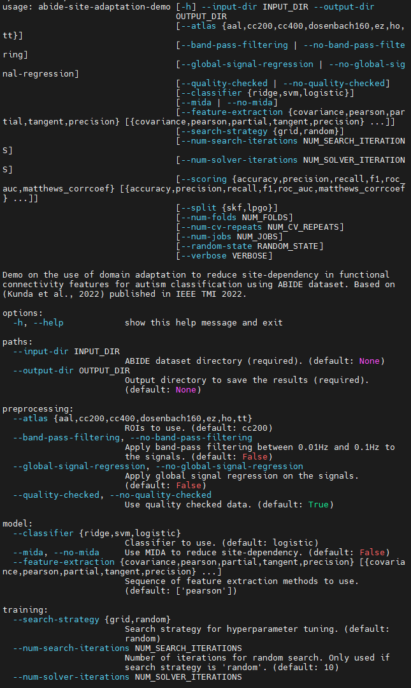
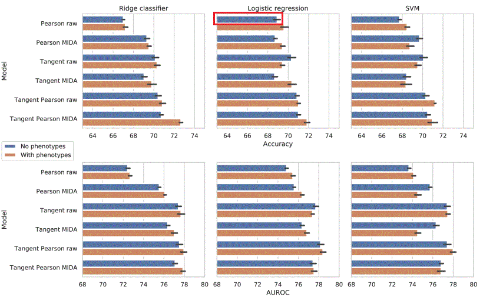

# Lab 10: Reproducible and Reusable AI

[COM6012 Scalable Machine Learning **2025**](https://github.com/COM6012/ScalableML) by Xianyuan Liu, Lalu Muhammad Riza Rizky, and Shuo Zhou, 8th May 2025

Reproducible and reusable research is essential for validating results, building upon previous work, and ensuring that findings can be trusted and applied in real-world scenarios. Today, reproducibility and reusability are core principles in AI and machine learning research, enabling the development of impactful and credible studies. In this lab, you will learn how to use Google Colab and containers to reproduce the experimental results of recent research.

## Study Schedule

- [Task 1](#1-use-google-colab-to-extract-alloy-data-from-scientific-pdfs): To finish in the lab session on 8th May. **Essential**
- [Task 2](#2-containerised-ml-workflow-for-multi-site-autism-classification): To finish in the lab session on 8th May. **Essential**
- [Task 3](#3-build-and-publish-your-own-image): To explore further. *Optional*

### Suggested reading

- [Google Colab frequently asked questions](https://research.google.com/colaboratory/faq.html)
- [Introduction to Apptainer](https://apptainer.org/docs/user/main/introduction.html)

## 1. Use Google Colab to extract alloy data from scientific PDFs

[](https://colab.research.google.com/github/xianyuanliu/alloy-property-extraction-demo/blob/main/NLP_for_Materials.ipynb)

This lab task aims to use Large Language Models (LLMs)
to extract alloy data from a dummy scientific PDF via [Google Colab](https://colab.research.google.com/), based on our current research,
adapted from our recent presentation at the [TOTEMIC Training School 2025](https://github.com/xianyuanliu/alloy-property-extraction-demo).
Please note that this is a demonstration only. It does not use real data, and the approach may not perform as expected when applied to actual scientific documents.
> ☁️ Google Colab is a free cloud-based Jupyter notebook environment that allows you to write and execute Python code in your browser. It provides access to powerful hardware, including GPUs and TPUs, making it an excellent choice for machine learning tasks.

### 🔧 1.1. Setup Guide

All steps are run on **Google Colab**. You do not need to install anything locally.

1. Make sure to access the GPU by going to `Runtime > Change RunTime type > T4 GPU`.

2. [Sign up for Hugging Face](https://huggingface.co/join) for free to obtain a token to access the LLaMa models via the Transformers Library.

3. Request access to the LLaMa model that we are going to use in this demonstration [LLaMa-3.2-3B-Instruct](https://huggingface.co/meta-llama/Llama-3.2-3B-Instruct).

### 📖 1.2. Usage Guide

Please begin by reading the [Usage Guide](https://github.com/xianyuanliu/alloy-property-extraction-demo?tab=readme-ov-file#usage-guide) to familiarise yourself with the overall process.
Once ready, [open in Colab](https://colab.research.google.com/github/xianyuanliu/alloy-property-extraction-demo/blob/main/NLP_for_Materials.ipynb) and run the notebook code cells step by step extract the alloy names and phase proprties.

Enjoy 🎉

## 2. Containerised ML workflow for multi-site autism classification

In this section, you will use a container to reproduce part of the experimental results of a recent research paper:

> Kunda, M., Zhou, S., Gong, G., & Lu, H. (2022). [Improving multi-site autism classification via site-dependence minimization and second-order functional connectivity.](https://ieeexplore.ieee.org/abstract/document/9874890) *IEEE Transactions on Medical Imaging*, 42(1), 55-65.

This paper is adapted from a MSc dissertation by Mwiza Kunda, which was supervised by Haiping Lu and co-supervised by Shuo Zhou. This is an example showing the research done within a MSc dissertation project at Sheffield can be published in a top_tier journal.

This work uses machine learning to classify autism spectrum disorder (ASD) using functional magnetic resonance imaging (fMRI) data from the [Autism Brain Imaging Data Exchange (ABIDE) I dataset](https://fcon_1000.projects.nitrc.org/indi/abide/abide_I.html). We have built a container image that contains the code and dependencies needed to reproduce the results of this study. Follow the instructions below to run the container and reproduce the results.
> ⚠️ **Disclaimer**: The container image is not the same as the one used in the original research paper. It is a reimplementation of the methodology using PyKale [[2]](#-references), an open-source Python library created and maintained by the machine learning research team at Sheffield.

<!-- The lab task aims to reproduce the work in our recent research [1],
which proposes a second-order functional connectivity measure called Tangent Pearson describing the ''tangent correlation of correlation'' of brain region activity.
This study also explores the use of domain adaptation for integrating multi-site neuroimaging data evaluated for autism classification.
The internal codebase reimplements the methodology using PyKale [2]. -->

### 💡 2.1. Introduction to containers for AI

Reproducing AI/ML experiments is often challenging due to a range of factors that can influence results, such as the operating system, programming language versions, library dependencies, and random seed settings.
Frequently, the original code is tightly coupled to a specific environment and setup, making it difficult to run elsewhere.
As a result, researchers often spend much time adapting code or setting up environments to replicate existing results — time that could be used to develop new models.

*[Containers](https://en.wikipedia.org/wiki/Containerization_(computing))* are a convenient tool for addressing the reproducibility issues common in AI/ML experiments. They allow practitioners to define and package a specific combination of environments, such as operating systems, libraries, and dependencies, ensuring that experiments can be reproduced exactly. Moreover, because the entire codebase is encapsulated within the container, it can be easily reused to run different experiments, saving time and effort.

This section demonstrates how to deploy and run pre-built containers in a high-performance computing (HPC) environment.

[Docker](https://www.docker.com/) is the most widely used platform for container deployment. However, it is typically not supported on HPC systems, including the HPC at Sheffield, due to security concerns, as it requires root permission.

The Sheffield's HPC cluster Stanage supports containers based on [Apptainer](https://apptainer.org/), which operates without requiring root-level daemon access. You can learn more in the [Stanage documentation on Apptainer](https://docs.hpc.shef.ac.uk/en/latest/stanage/software/apps/apptainer.html).

To use an Apptainer container image on Stanage, first log in via SSH

```sh
ssh $USER@stanage.shef.ac.uk
```

Replace `$USER` with your username (using **lowercase** and without `$`).

Request a core from the reserved nodes using

```sh
srun --account=rse-com6012 --reservation=rse-com6012-9 --time=01:00:00 --pty /bin/bash
```

or from the general queue via

```sh
srun --pty bash -i
```

<!-- Alternatives that do not require elevated access include [Apptainer](https://apptainer.org/) and [Podman](https://podman.io/). -->

<!-- In this guide, we will use **Apptainer**, as it is the container platform available on the University of Sheffield’s (UoS) HPC systems. -->

### 🔧 2.2. Setting up the container

Before deploying a container, we first need a container image that includes the environment and the code/program to be executed.
> 📦 A *container image* is a packaged snapshot of an environment, including the application code, libraries, and dependencies needed to run a program.

We have created an Apptainer container image and uploaded it to the HPC at

```sh
/mnt/parscratch/users/ac1xxliu/public/lab10-data/abide-demo.sif
```

You can use this image directly for the lab task. If you require your own Apptainer image, create one by following the instructions below.

#### Creating an Apptainer image by pulling from a registry (optional, estimated time: 30 minutes)

To use the pre-built image, we can skip the pull step and directly run the container.
For the rest of the steps, we assume that the image is stored in this directory.

Log in to Stanage and request a core from the reserved nodes using the command above. Next, pull and build an Apptainer container image from a registry. Commonly used registries include [Docker Hub](https://hub.docker.com) and [GitHub Container Registry (GHCR)](https://docs.github.com/en/packages/working-with-a-github-packages-registry/working-with-the-container-registry). In our case, we will pull an image from GHCR that is used to train and evaluate an autism classifier with a multi-site dataset called ABIDE.
   > A *registry* is a storage and distribution system for these container images.
   > Think of it like a version-controlled library or repository for containers.
   > Developers build images locally and then push them to a registry so others can download (or pull) and run them in any compatible container runtime.

In a real-world setting, the container image is typically pulled directly from a remote registry and built on the user's system. This is done using the following command:

```sh
apptainer pull $IMAGE_NAME.sif docker://ghcr.io/zarizk7/abide-demo:master
```

It will pull and build an image with a `*.sif` extension. You could replace `$IMAGE_NAME` with a name of your choice, such as `abide-demo`.
If `$IMAGE_NAME` is left blank, by default it will be set to `$REPO_$TAG`, where `$REPO` is the repository name and `$TAG` is the image's version.
Once the image has been pulled, we can find it in our working/specified directory.

### 🧐 2.3 Exploring the container

1. Before we enter the container, we can check the system version via

   ```sh
   cat /etc/os-release
   ```

   This will show the operating system version `CentOS Linux 7 (Core)`.

   Lode conda environment

   ```sh
   module load Anaconda3/2024.02-1
   ```

   Check our current python version and scikit-learn version on the HPC node by running:

   ```sh
   python --version; pip list | grep scikit-learn
   ```

   The output should be `Python 3.11.7` and `scikit-learn 1.2.2`. Please remember these versions, as we will compare them with the versions inside the container later.

2. Then, we use the `apptainer shell` command to enter the container's shell environment.

   ```sh
   apptainer shell /mnt/parscratch/users/ac1xxliu/public/lab10-data/abide-demo.sif
   ```

    This allows us to interact with the container as if we were inside it. You should see a prompt similar to the PySpark interactive session as following:
  
    ```sh
    Apptainer>
    ```

   Now, we can check the system version in the container via the same command:

   ```sh
   cat /etc/os-release
   ```

   🤔 Any difference?

   Then, check the python version and scikit-learn version inside the container by running:

   ```sh
   python --version; pip list | grep scikit-learn
   ```

   Different again!

   You can also list the installed libraries in the container by running:

   ```sh
   pip list 
   ```

   To exit the container, simply type `exit` or press `Ctrl+D`.

### ▶️️ 2.4. Reproducing AI research using Apptainer

1. After creating an Apptainer image, we can deploy a container using the image to train and evaluate the model. With a container-/script-based code for model training/evaluation, there usually going to be many flags/variables that we can set. To see the available flags, we can call:

    ```sh
    apptainer run /mnt/parscratch/users/ac1xxliu/public/lab10-data/abide-demo.sif -h
    ```

   The output will show the help message, including the available flags and their descriptions as shown below:

   

   There are more flags, read them carefully to for more information. We will find that there are many flags/variables that can be set to do experiment. The required ones are `--input-dir` and `--output-dir`, specifying the path to the dataset and output directory respectively.

2. The classification task in the research paper is to classify autism patients from healthy controls. Each subject is represented by a `num_brain_regions` $\times$ `num_brain_regions` matrix (network), where each entry is the correlation between fMRI signals of the two brain regions. There are multiple methods to compute the correlation, such as Pearson correlation and Tangent. The matrices have been vectorized for classification. The processed data used in the experiments has been uploaded to `/mnt/parscratch/users/ac1xxliu/public/lab10-data/dataset`.

   The research paper presents many experimental results, for example, the bar highlighted by the red box in the figure below (Fig. 3 of the research paper) shows the accuracy of using the Pearson correlation as input features and logistic regression as classifier for autism classification. The results are obtained by running 5 $\times$ 10-fold cross-validation.

   

   To reproduce the experiments using Apptainer, run the following command:

   ```sh
   apptainer run \
        /mnt/parscratch/users/ac1xxliu/public/lab10-data/abide-demo.sif \
        --input-dir /mnt/parscratch/users/ac1xxliu/public/lab10-data/dataset \
        --output-dir $HOME/outputs/abide-demo \
        --split skf \
        --random-state 0 \
        --num-folds 10 \
        --num-cv-repeats 5 \
        --verbose 1
   ```

   It will take around 10 minutes to finish running. In the commands above, the `--split` flag specifies the cross-validation splitter to be used, which is set to `skf` (Stratified K-Folds). The `--num-folds` and `--num-cv-repeats` flags specify the number of folds and repeats for 5 $\times$ 10-fold cross-validation. The `--verbose` flag controls the verbosity of the output, with a value of 1 indicating that detailed information will be printed during the training process.

   The output folder will be created automatically at `$HOME/outputs/abide-demo`. To ensure that the results obtained are reproducible, we will need to set an integer value for `--random-state`. Without it being set, we will not be able to get consistent results as some algorithms used for the model and evaluation is a stochastic method.

3. After the container finished running, the output directory will contain:
   - `args.yaml`: All of the arguments defined during the container's deployment time.
   - `cv_results.csv`: Cross-validation runtime, prediction scores, and hyperparameters.
   - `inputs.npz`: Features extracted from the data used to train the model.
   - `model.joblib`: A trained model using the optimal hyperparameter settings identified during the tuning process.
   - `phenotypes.csv`: Preprocessed phenotypic information of the subjects used for domain adaptation.

4. To check the results, we provide a python file `get_top_score.py` to parse the scores from `cv_results.csv`.
We can run it via

   ```sh
   python /mnt/parscratch/users/ac1xxliu/public/lab10-data/get_top_score.py $HOME/outputs/abide-demo
   ```

   The output will be the top 5 scores from the cross-validation results, which are saved in `cv_results.csv`. You should see an output similar to the one below:

   ```sh
                  accuracy
    Rank
    1     0.6969 ± 0.0447
    2     0.6948 ± 0.0317
    3     0.6946 ± 0.0445
    4     0.6939 ± 0.0314
    5     0.6936 ± 0.0318
   ```
  
   The output shows the top 5 accuracy scores from the cross-validation results, along with their standard deviations. The scores are sorted in descending order, with the highest score at the top. The accuracy is around 0.69, which is consistent with the accuracy reported in the research paper.

Please make a note of the output values, as we will compare them with the results obtained after changing the random seed.  

### 🧾 2.5. Running with `sbatch` (optional)

Provides the same functionality as in section 2.4, but implemented differently.
Can be skipped if you are not interested in using `sbatch` to run the container.

Alternatively, we can use `sbatch` to run the Apptainer command to run the workflow.
It is useful when we expect a long runtime as `srun` session will disconnect after certain time idling.
Suppose that we already have the Apptainer image pulled (steps 1-3 done), we can create a shell file for sbatch to run.
An example includes the following:

First, we create a shell script `run-abide-demo.sh` via `nano` or `vim`.

An example using `vim` is shown below.

```sh
cd $HOME
vim run-abide-demo.sh
```

Press `i` to enter the insert mode, and then copy and paste (`ctrl+shift+v`) the following code into the file.

```sh
#!/bin/bash

#SBATCH --job-name=abide-demo
#SBATCH --time=01:00:00

OUTPUT_DIR=$HOME/outputs/abide-demo

mkdir -p $OUTPUT_DIR

apptainer run \
    /mnt/parscratch/users/ac1xxliu/public/lab10-data/abide-demo.sif \
    --input-dir /mnt/parscratch/users/ac1xxliu/public/lab10-data/dataset \
    --output-dir $OUTPUT_DIR \
    --random-state 0
```

Then press `esc` to exit the insert mode, and type `:wq` to save and quit.

Next, deploy the container with `sbatch` we can simply call:

```sh
sbatch run-abide-demo.sh
```

Use command [`squeue`](https://docs.hpc.shef.ac.uk/en/latest/referenceinfo/scheduler/SLURM/Common-commands/squeue.html), [`sstat`](https://docs.hpc.shef.ac.uk/en/latest/referenceinfo/scheduler/SLURM/Common-commands/sstat.html), or [`sacct`](https://docs.hpc.shef.ac.uk/en/latest/referenceinfo/scheduler/SLURM/Common-commands/sacct.html#gsc.tab=0) to check the job status.

For checking the logs during the job's runtime, use command:

```sh
cat slurm-$JOB-ID.out
```

where `$JOB-NUMBER` is the job id given when calling `sbatch`

Once the job is shown to be `COMPLETED` in `sacct`, we will expect the same output described in step 6.

### 🎲 2.6. Changing random seeds and reproduce more experiments

To change the random seed, we can simply change the `--random-state` flag to a different integer value.
For example, to set the random seed to 1, we can run:

```sh
apptainer run \
    /mnt/parscratch/users/ac1xxliu/public/lab10-data/abide-demo.sif \
    --input-dir /mnt/parscratch/users/ac1xxliu/public/lab10-data/dataset \
    --output-dir $HOME/outputs/abide-demo \
    --random-state 1 \
    --verbose 1
```

The output will be saved in the same directory as before, but with a different random seed.
    We can check the results by running the `get_top_score.py` again to see the scores.

```sh
   python /mnt/parscratch/users/ac1xxliu/public/lab10-data/get_top_score.py $HOME/outputs/abide-demo
```

Compare the output with that from 2.4.
The top 5 scores should be different, as the random seed initialises the random number generator, introducing controlled randomness into the training process of many machine learning models.

🤔 What happens if we reset the random seed to 0?
Can you try it and see if the results match your earlier output?

📌 Please do consider the random seed when you are reproducing the model.
Note that the random seed is not the only factor that can affect the reproducibility of the results.
What other factors can affect the reproducibility of the results we talked in the lecture? 💭

#### Read the research paper and reproduce more experiments with the settings that you are interested in (Optional)

## 3. Build and publish your own image

**Note**: This is an open-ended exercise. No solutions will be provided.

This task challenges you to apply what you have learned by building and publishing your own container image to either Docker Hub or GitHub Container Registry (GHCR).
If you are using our provided [source code](https://github.com/zaRizk7/abide-demo), please review the [`deploy-image.yml`](https://github.com/zaRizk7/abide-demo/blob/master/.github/workflows/deploy-image.yml) workflow file.
Think about how you might adapt it to suit your own containerised workflow.

### Preparation

Before you begin, ensure the following:

- Docker is already installed on your host machine.
- You have created a [Docker account](https://app.docker.com/signup).
- You have cloned the container's [source code](https://github.com/zaRizk7/abide-demo) or other source code you want to use.

### Potential task breakdown

If you want to change provided [source code](https://github.com/zaRizk7/abide-demo) for building and publishing your own image, you can complete the following tasks we set for you. Use the linked documentation for guidance where needed:

- Add another cross-validation split to the source code
  - Refer to [model_selection.splitters](https://scikit-learn.org/stable/api/sklearn.model_selection.html#splitters) in scikit-learn.
- (Optional) Add additional classifiers with their hyperparameter grid to the source code.
  - Refer to [scikit-learn api](https://scikit-learn.org/stable/api) documentation.
- Test your code locally
  - Ensure the code runs correctly outside a container.
- Update dependencies in the container
  - Update the `requirements.txt` file to include the specific versions of the dependencies, such as `scikit-learn==1.6.1`.
- Build the Docker image
  - Follow [Docker's build and push tutorial](https://docs.docker.com/get-started/introduction/build-and-push-first-image/).
- Run the containerised code
  - Check that the output is correct and consistent with the non-container version.
- Publish your image
  - Push the image to Docker Hub (or GHCR if preferred).

You can also explore other models on [GitHub Topics](https://github.com/topics) or [HuggingFace Models](https://huggingface.co/models) to find one that interests you and try building a container image with your defined breakdown tasks.

## 📖 References

[1] *Kunda, Mwiza, Shuo Zhou, Gaolang Gong, and Haiping Lu*. **Improving Multi-Site Autism Classification via Site-Dependence Minimization and Second-Order Functional Connectivity**. IEEE Transactions on Medical Imaging 42, no. 1 (January 2023): 55–65. [https://doi.org/10.1109/TMI.2022.3203899](https://doi.org/10.1109/TMI.2022.3203899).

[2] *Lu, Haiping, Xianyuan Liu, Shuo Zhou, Robert Turner, Peizhen Bai, Raivo E. Koot, Mustafa Chasmai, Lawrence Schobs, and Hao Xu*. **PyKale**. In Proceedings of the 31st ACM International Conference on Information & Knowledge Management. New York, NY, USA: ACM, 2022. [https://doi.org/10.1145/3511808.3557676](https://doi.org/10.1145/3511808.3557676).
